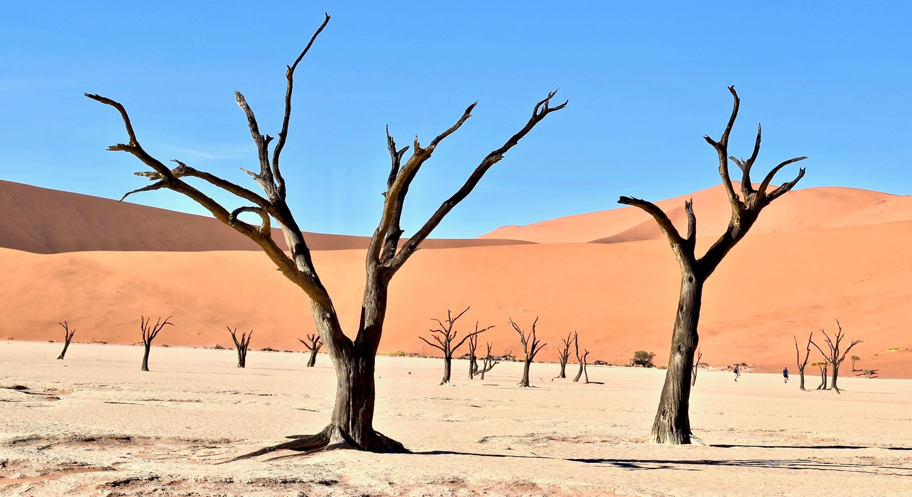

# Desertification

**Desertification** is the change of fertile land becoming desert-like and unusable. The causes are very wide, inlcuding global warming, urbanization and _overpopulation_, deforestation, and overgrazing. _Although_ this is not a serious issue in the Pacific Northwest, it is a issue world-wide as there is an **increase** in the total percentage of arid land globally. This is an issue because societies and settlements in those areas will _not_ get sufficient nutrients from plantlife as they need.

>"For more and more rural communities at the mercy of the environment, migration appears to be the only choice." -BBC

Additional Information:
- Desertification has a possibility of being [irreversiblle](https://earthobservatory.nasa.gov/features/Desertification/desertification2.php).
- [Migration](https://www.bbc.com/news/world-africa-34790661) is one of the only immediate solutions for society.
- Other [long-term solutions](https://www.theguardian.com/world/2019/jul/29/ethiopia-plants-250m-trees-in-a-day-to-help-tackle-climate-crisis) that can be applied to areas before the change in environemnt include planting trees and other life.

